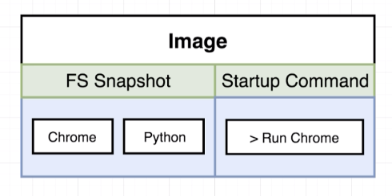
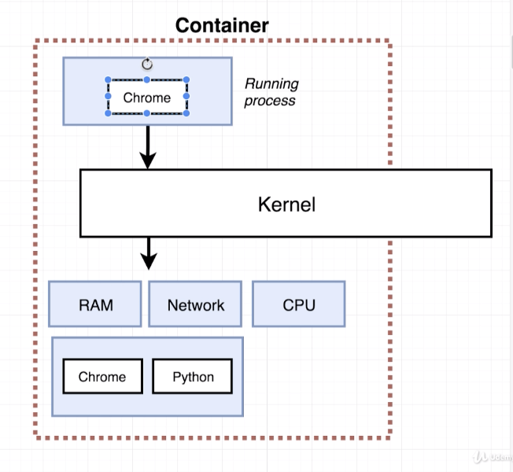
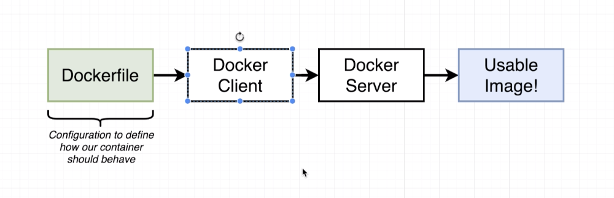
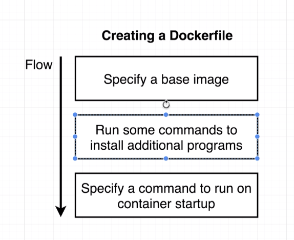
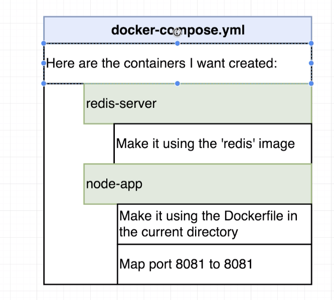

# Getting Started

* Install [Docker](https://www.docker.com/products/docker-desktop)

---

## Key Words

View

`Docker Client(CLI)`

Takes our commands, processes them, and sends to the `Docker Server`

`Docker Server(Daemon)`

Responsible for creating/modifying images and running/maintaining containers

`Docker Image`

Single file with all dependencies and configurations required to run a program

`Docker Container`

Instance of a `Docker Image`

`Image Cache`

This is where any `Docker Images` on our local machine are stored

`Dockerfile`

Configuration to define how the `Docker Container` should behave

---

## Commands

View

`docker run <image name> <override command>`

Creates and runs a `Docker Container` using `docker create <image name>` + `docker start <container ID>`

`Docker Server` checks our local machine's `Image Cache` for a `Docker Image` with the given name.  If not on our local machine, then the server reaches out to `Docker Hub` for an image by the given name, downloads, stores it in our `Image Cache`, and uses it to create a `Docker Container`. Either way the program inside the `Docker Container` is ran

Can specify an override command to execute inside of the `Docker Container` instead of the default command

Add `-p externalPort:containerPort` before the <image name> to enable port forwarding

`docker start <container ID>`

Restart a stopped container

`docker system prune`

Remove all stopped containers, unused networks, and dangling images
>Note: This clears the `Image Cache`

`docker logs <container ID>`

Retrieve logs for a specific container
>Note: This does not restart the container, but outputs what the container emitted

`docker stop <container ID>`

Gives the container time to shut itself down

If it does not shutdown after 10 seconds, then the kill command is ran

`docker kill <container ID>`

Shuts the container down immediately

`docker exec -it <container id> command`

Runs another command on a `Docker Container`

Example - Running a redis container and wanting to start the redis-cli:

`docker run redis`

`docker exec -it <container id> redis-cli`

`docker build .`

Gives `Dockerfile` to the `Docker CLI` which then uses the `Docker Server` to create a useable `DockerImage`

Can use `docker build -t <docker id>/<project name>:<version> .` to tag the Image

---

## Building Custom Images Through Docker Server

1. Create a Dockerfile
    

    
    

    

---

## Container Port Mapping

By default no traffic will be redirected to a container

`docker run -p <externalPort>:<containerPort> <image name>`

---

## Docker Compose

Used to start multiple containers at the same time & automate all commands needed to build & start a container

What docker-compose does

1. Create a `docker-compose.yml` file to feed to the `docker-compose CLI`

---

## Docker Volumes

Way of "hot reloading" a docker container when making code changes

---